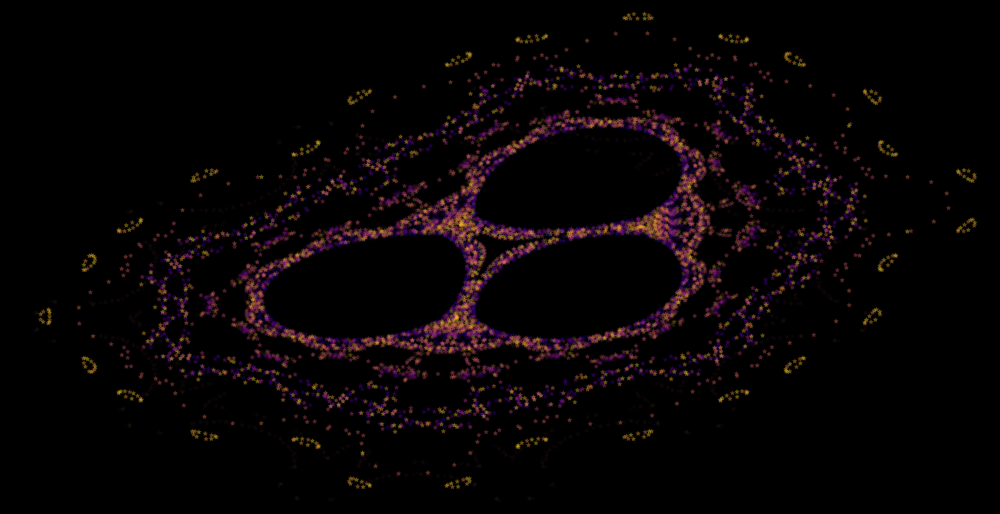
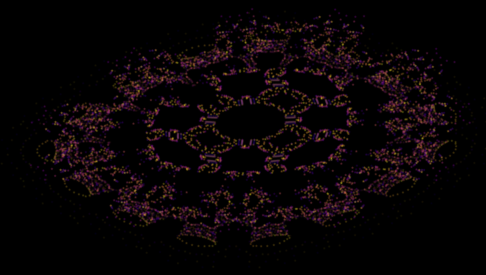
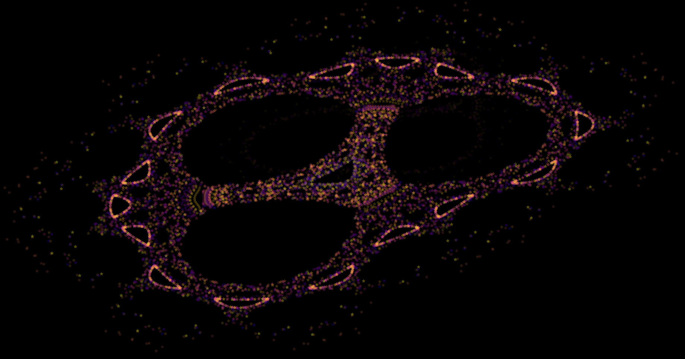
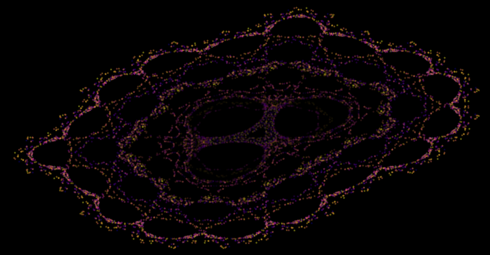
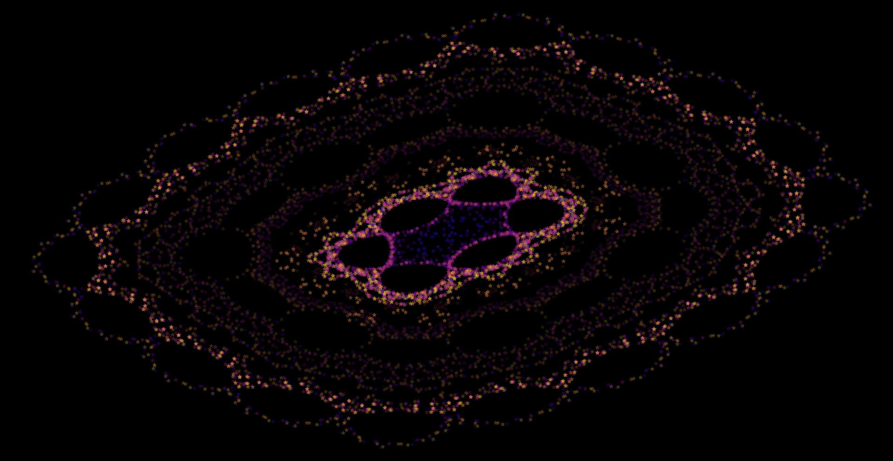
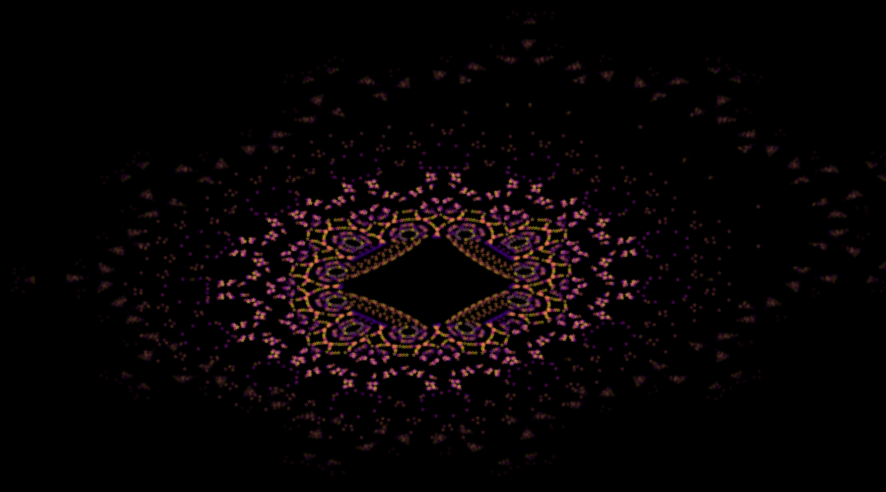
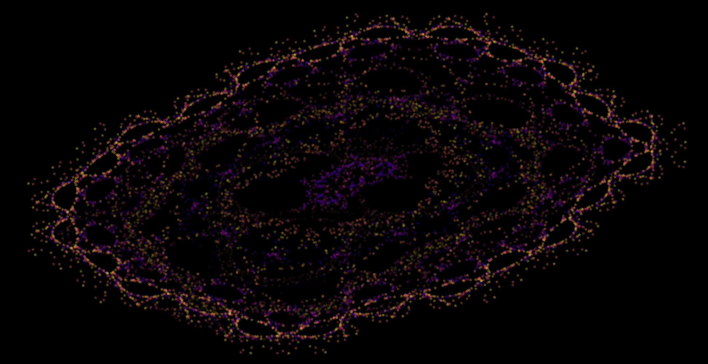
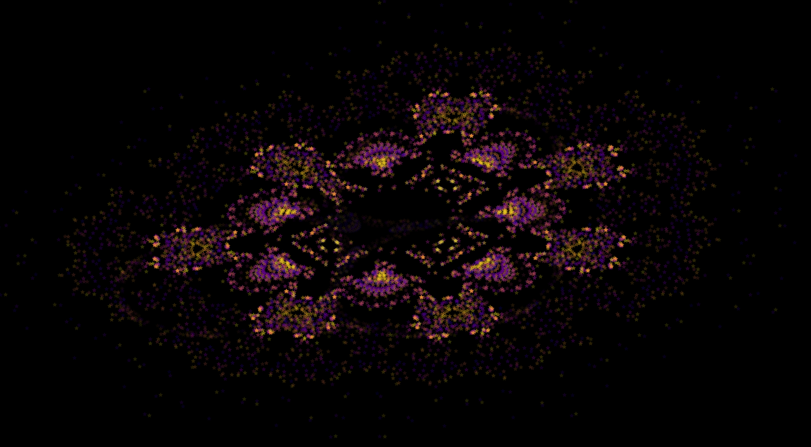
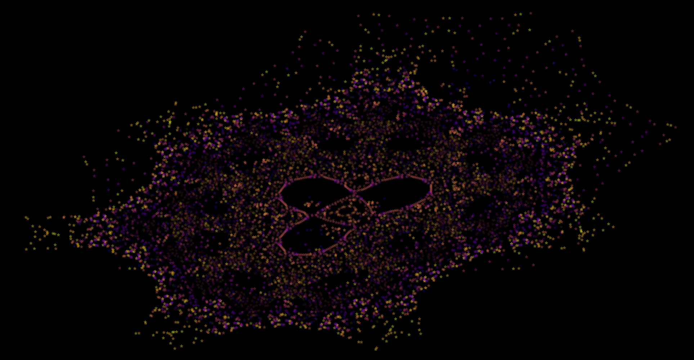

# Hop Along Visualiser


Fun visualiser for Barry Martin Hop Along fractals (using [this document](https://www.jolinton.co.uk/Mathematics/Hopalong_Fractals/Text.pdf) as a reference).
Iterations are calculated with `numba`, and rendered using `matplotlib`.

## Setup

Install requirements and run script.

```sh
python -m pip install -r requirements.txt
python hopalong.py
```

I've not tested version requirements. The versions I have been using are:

```text
python==3.10.11
numpy==2.2.6
numba==0.61.2
matplotlib==3.10.5
pyQt5==5.15.11 
```

I found that using Qt5 backend for matplotlib prevented the window from grabbing focus
each time it updated.

## Options

```sh
python hopalong.py --help
```

### Control the number of iteration per frame

```sh
python hopalong.py --niters 1000
```

### Control the number of frames before rendered iterations disappear

```sh
python hopalong.py --nhist 10
```

If this value is set to 0, the frame is completely cleared with each update.

### Control the number of frames before hop along parameters are reset

```sh
python hopalong.py --nreset 10
```

If this value is set to 0, the parameters are never reset.
Low values (e.g., 1) create very chaotic (but fun) visuals as multiple structures are layered.
Larger values create more stable strutures, but too large and the visual can feel less dynamic.

### Control target framerate

```sh
python hopalong.py --fps 25
```

Defaults to 25 fps for cinematic experience although my PC can only handle about 11 fps.

## Example Images










